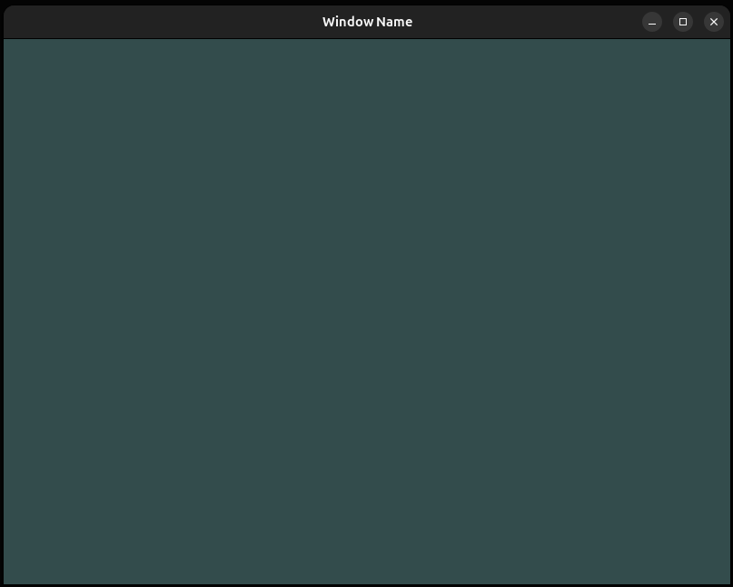
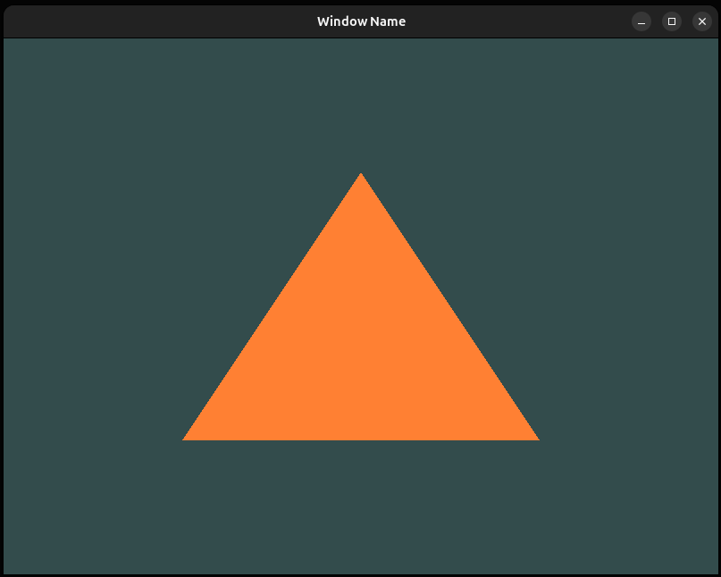

# OpenGL Fundamentals

It's basically my way through ***[Learn OpenGL](https://learnopengl.com/)*** book and some research in graphics with OpenGL.

---
## Set up a window

Functions to resize the window during the callback and basic input processing function, that close the window in this example.

```cpp
void framebuffer_size_callback(GLFWwindow* window, int width, int height);
void processInput(GLFWwindow *window);
```




## Triangle

I've set up a triangle. Created some basic shaders, vertex shader and fragment shader.

```cpp
const char *vertexShaderSource = "#version 450 core\n"
    "layout (location = 0) in vec3 aPos;\n"
    "void main()\n"
    "{\n"
    "    gl_Position = vec4(aPos.x, aPos.y, aPos.z, 1.0);\n"
    "}\0";

const char *fragmentShaderSource = "#version 450 core\n"
    "out vec4 FragColor;\n"
    "void main()\n"
    "{\n"
    "   FragColor = vec4(1.0f, 0.5f, 0.2f, 1.0f);\n"
    "}\n\0";
```


