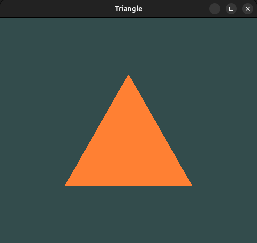
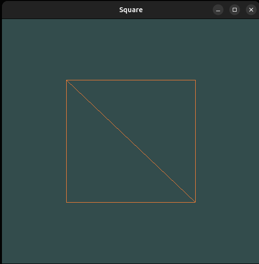

# ***OpenGL Fundamentals***

It's basically my way through ***[Learn OpenGL](https://learnopengl.com/)*** book and some research in graphics with OpenGL. I'd leave my notes and ideas here, so it's going to be such a notebook.

---

## ***OpenGL Buffers***
Primarily, need to define how OpenGL handle the memory access with buffers.

In CPU world you store data in RAM using variables, arrays etc. You work with them via pointers or references. However, in GPU world, ***buffers*** are chunks of GPU memory. You can't get a pointer to them, you work with them through an ***integer ID*** (handle) that OpenGL provides.

***Loading data into a GPU buffer***

1. Generate an ID

CPU analogy: like integer pointer. You now have a ***label*** but not allocated memory yet. 
```cpp
GLuint vbo;
glGenBuffers(1, &vbo);
```

2. Bind the buffer to a target

Basically, like deciding the "type" of that memory.

CPU analogy: "this pointer will store vertex data", but instead of a type keyword, you specify a target (***GL_ARRAY_BUFFER***, ***GL_ELEMENT_ARRAY_BUFFER***, etc.).

```cpp
glBindBuffer(GL_ARRAY_BUFFER, vbo);
```

3. Allocate storage and upload data

Like ***malloc()*** + ***memcpy()*** in C terminology.

CPU analogy: allocates space and then fills it with your data. In OpenGL, ***glBufferData*** does both at once.

```cpp
glBufferData(GL_ARRAY_BUFFER, sizeof(vertices), vertices, GL_STATIC_DRAW);
```

***Example***
```cpp
// CPU:
int arr[3] = {1, 2, 3};

// GPU:
float array[3] = {1.0f, 2.0f, 3.0f};

GLuint id;
glGenBuffers(1, &id);
glBindBuffer(GL_ARRAY_BUFFER, id);
glBufferData(GL_ARRAY_BUFFER, sizeof(array), array, GL_STATIC_DRAW);
```

## ***Shaders***

Then, I'd like to talk about shaders foundation, what are they and how to interact with them. In consequence, I'd like to draw a triangle and write some shaders for it using ***GLSL*** (OpenGL Shading Language).

***Graphics Pipeline***


1. **Vertex Array**  
   - Holds all the vertex data (positions, colors, normals, etc.).

2. **Element Array**  
   - Defines how vertices are connected (which ones form triangles).

3. **Vertex Shader**  
   - Processes each vertex individually.  
   - Transforms positions and passes data forward.  
   - Can use extra data from **uniforms** (like matrices or textures).

4. **Triangle Assembly**  
   - Groups processed vertices into primitives (triangles, lines, points).

5. **Rasterization**  
   - Converts primitives into fragments (potential pixels on the screen).

6. **Fragment Shader**  
   - Runs per fragment.  
   - Computes final pixel color (using lighting, textures, etc.).

7. **Testing and Blending**  
   - Depth test, stencil test, alpha blending, etc.  
   - Decides visibility and mixes pixels properly.

8. **Framebuffer**  
   - Stores the final image that will be displayed on screen.

***Writing Shaders***

Modern OpenGL requires that we at least set up a vertex and fragment shader if we want to do some rendering.

In the example below, I've configured ***Vertex*** and ***Fragment*** shaders.

```cpp
// vertex shader configuration
const char *vertexShaderSource = "#version 450 core\n"
    "layout (location = 0) in vec3 aPos;\n"
    "void main()\n"
    "{\n"
    "    gl_Position = vec4(aPos.x, aPos.y, aPos.z, 1.0);\n"
    "}\0";

// fragment shader configuration
const char *fragmentShaderSource = "#version 450 core\n"
    "out vec4 FragColor;\n"
    "void main()\n"
    "{\n"
    "   FragColor = vec4(1.0f, 0.5f, 0.2f, 1.0f);\n"
    "}\n\0";
```

In order for OpenGL to use the shader it has to dynamically compile it at run-time from its source code.
```cpp
unsigned int vertexShader;
vertexShader = glCreateShader(GL_VERTEX_SHADER);
// next we attach the shader source code to the shader object and compile the shader
glShaderSource(vertexShader, 1, &vertexShaderSource, NULL);
glCompileShader(vertexShader); 
```

***Shader program***
A shader program object is the final linked version of multiple shaders combined. To use the ppreviously compiled shaders we have to link them to a shader program object and then activate this shader program when rendering objects.

When linking the shaders into a program it links the outputs of each shader to the inputs of the next shader.

```cpp
unsigned int shaderProgram;
shaderProgram = glCreateProgram(); // creates a program and returns the ID ref to the object
// attaching the previously compiled shaders to the program objecct and linking them
glAttachShader(shaderProgram, vertexShader);
glAttachShader(shaderProgram, fragmentShader);
glLinkProgram(shaderProgram);
```

## ***Linking Vertex Attributes***

The vertex shader allows us to specify any input we want in the form of vertex attributes and while this allows ffor great flexibility, it does mean we have to manually specify what part of out input data goes to which vertex attribute in the vertex shader. This means we have to specify how OpenGL should interpret the vertex data before rendering.

***Essence of enabling vertex attributes***
1. glEnableVertexAttribArray(location) → activates a vertex attribute (disabled by default).
2. This links the data in your buffer to the shader’s inputs, so the GPU knows how to feed vertex attributes (position, color, etc.) into the vertex shader automatically.

Drawing an object in OpenGL would look something like this:
```cpp
// 0. copy our vertices array in a buffer for OpenGL to use
glBindBuffer(GL_ARRAY_BUFFER, VBO);
glBufferData(GL_ARRAY_BUFFER, sizeof(vertices), vertices, GL_STATIC_DRAW);
// 1. then set the vertex attributes pointers
glVertexAttribPointer(0, 3, GL_FLOAT, GL_FALSE, 3 * sizeof(float), (void*)0);
glEnableVertexAttribArray(0);  
// 2. use our shader program when we want to render an object
glUseProgram(shaderProgram);
// 3. now draw the object 
someOpenGLFunctionThatDrawsOurTriangle();   
```

Re-binding buffers and re-configuring vertex attributes for every object is slow and repetitive.

Solution: A ***Vertex Array Object*** stores all vertex attribute configurations. Once set up, you just bind the VAO to restore the whole state instantly when drawing.

To use a VAO all you have to do is bind the VAO using glBindVertexArray. From that point on we should bind/configure the corresponding VBO(s) and attribute pointer(s) and then unbind the VAO for later use. As soon as we want to draw an object, we simply bind the VAO with the preferred settings before drawing the object and that is it. In code this would look a bit like this (text and code from the book):

```cpp
// ..:: Initialization code (done once (unless your object frequently changes)) :: ..
// 1. bind Vertex Array Object
glBindVertexArray(VAO);
// 2. copy our vertices array in a buffer for OpenGL to use
glBindBuffer(GL_ARRAY_BUFFER, VBO);
glBufferData(GL_ARRAY_BUFFER, sizeof(vertices), vertices, GL_STATIC_DRAW);
// 3. then set our vertex attributes pointers
glVertexAttribPointer(0, 3, GL_FLOAT, GL_FALSE, 3 * sizeof(float), (void*)0);
glEnableVertexAttribArray(0);  

  
[...]

// ..:: Drawing code (in render loop) :: ..
// 4. draw the object
glUseProgram(shaderProgram);
glBindVertexArray(VAO);
someOpenGLFunctionThatDrawsOurTriangle();   
```

***Result of Configured shaders, VBO and VAO***




Then, to form a square, I've build it from two triangles and used ***wireframe mode***, so the wireframe rectangle shows that the rectangle indeed consists of two triangles.


